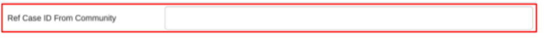

#  Entering records in eTB Register

To enter records into eTB Register do the following:

1. Select eTB Register from the list of registers listed in figure 8 above.
2. eTB Register will open and display a list of cases that have been registered in it based on the selected organization unit.

Figure 9: TB Cases registered in the system for selected Organization units.

3. Click on the register button to register a new TB case, registration form will open for filling the patient's demographic information as shown in figure 10.
4. Select the appropriate registration date and continue entering enrollment data.

Figure 10: The TB Case Enrolment Screen

Please note the following:
- The fields with red asterisk symbols in their label are mandatory and values must be entered to be able to proceed.
- Enrolling organization unit is the one you selected to enter data, if you want to change it then click on “Cancel” at the end of the enrolment form and go back to step 1 above.
- Registration Date is the date when the TB case was registered, is set to the current day by default but if registration was done on another day click on the date and pick the correct date.
- There is a new field that will track patients (clients) who come in the facility for TB Screening and potentially end up taking TB preventive treatment or TB treatment.
- For a patient that comes in for TB screening select “Screening for TB” or select “TB Treatment” for TB cases in the Visit type field as shown in figure 11.

Figure 11: Visit type option fields for TB patient/TB Screening patient

- For a client who has come for TB screening, the system will categorize the case based on the data entered in the fields that check for potential TB infection as shown in figure 11.

Figure 12: TB Screening fields

- For a client who has not shown/presented TB infection and is potentially eligible will proceed with the TB Preventive Treatments by selecting “Yes” in the field Is client potentially eligible for TPT?
- For a client that has been referred from the community, you will specify the referral case id at the Ref Case ID From Community field otherwise leave it empty.

Figure 12: Community Referral Case ID field in eTB register

- Specify the report date, and select “Yes” or “No” as specified in Figure 13 if the client is presenting TPT comorbidity.

Figure 13: TPT Comorbidities stages

- In the TPT Initiation stages, specify details as shown and be keen to watch for the error message/notification thrown by the system.

Figure 14: TPT Initiation stages

- For the TPT Adherence stages, please fill in the information following the uptake of the TPT dosage such as Medication adherence, Severe adverse events, Mild adverse events, TPT Non-completion as shown in the figure 15.

 
Figure 15: TPT Adherence stages

- TPT outcome as depicted in Figure 15 registers the outcome of the TPT uptake for.

FIgure 16: TPT Outcome stage

- TB District Number and DR-TB Number are partially automatically generated (E.g. 020302/KK/2017/…) for each new TB case registered and the last unique number for a patient is autofilled using TB No which are district/facility generated yearly.
- Age cannot exceed 99 years, and it is mandatory.
- The Site option is hidden when Disease Classification is Pulmonary.
- If “Started Treatment” field is selected “No” or “Died before start of treatment”, Start of treatment date, regimen, DOT Option, and Tambua TB messages will be hidden otherwise you will be required to fill the details about start of treatment in figure 17.

Figure 17: Details about start of treatment

- On TB regimen, the kids’ regimen is hidden when the client’s age is above 15 years.
- On Pre-treatment Lab Result a field to choose appropriate test results will come up depending on the selected test.
- On selecting “No” in the field, “Is Client a Foreigner” the option for filling “Country of residence” will disappear as the patient will automatically be Tanzanian.

5. Click on:
- “Save and continue” to save enrollment (registration) of the TB case and continue entering further records related to the TB case as shown in the figure 11.
- “Save and add new” to continue enrolling other cases for the same organization unit and later you can get back to enter further stages of each case one after another.
- “Print form” to print blank enrolment form.
- “Cancel” to cancel registration.

After clicking save and continue, a new screen with the stages contained in the eTB register as in Figure 18 will open up to allow data entrant to enter more treatment records for the case.

Figure 18: DST Follow up and Laboratory Tests section

Please note the following:
- A stage contains similar records about certain services provided to the patient.
- Some stages are common to both TB and DR-TB cases and some are specific depending on the type of case.
- Some stages open automatically and others will open up depending on specified program rules.
- After entering records in a specific stage you will be required to hit the Complete button so as to save the records. The button will be renamed as Incomplete and you will be required to click it for you to edit the records.

Figure 19: Various diagnosis TB tests options available

6. Once you have successfully Select Date of results and appropriate test done as appears in the dropdown list eg. Sputum microscopy. Please note the following:
   1. Depending on the test selected a new field will appear for you to fill in the test results.
   2. In the field that is written “Your note here”, you can type your note for the section when necessary and click add to keep the note but they are not used by the system they are just for your own uses.

7. Record the diagnosis result for the selected test as appears in Figure 20 and then click Complete to Save.

Figure 20: Recording test results

Please note the following:
- Several tests can be done over time for the same TB case. After saving the current test result, the system will open a new form where you can fill in the other results. You will only need to select the date of result and test then fill in results.
- You will be required to fill the details of this stage on every follow-up.

Figure 21: Adding more Test Results

8. Select the Contact Investigation section to fill in details of people who live in the same house with such a TB patient then click Complete to save.

Figure 22: Household Contacts details

9. Select Comorbidities/HIV status stage and fill in required details then click Complete to save.

Figure 23: Comorbidities stage

- On “HIV status” if the HIV Test results is Positive, new fields will pop up to fill in the patient’s HIV details.
- On “Diabetes status” if the status is Diabetic, a new field for choosing whether a client is enrolled to diabetic clinic or not will appear.
- Fill in other comorbidities “Hypertension” and “Cancer” if the patient was diagnosed against them.
- If Yes is selected on “Covid-19 Vaccination Status”, you will be required to fill in Covid-19 Vaccination Date.
